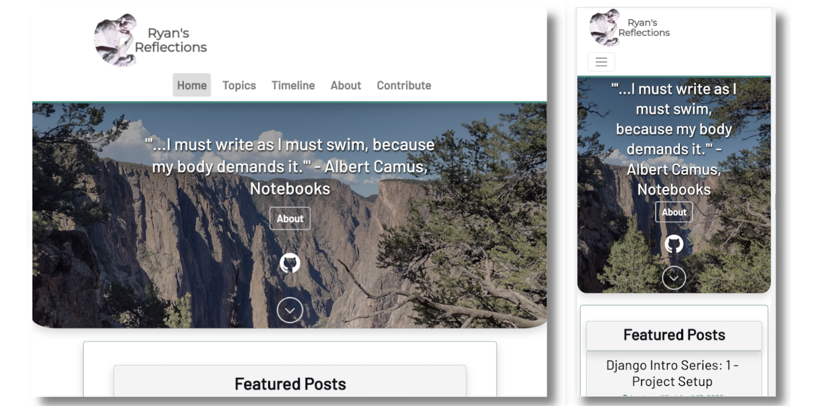
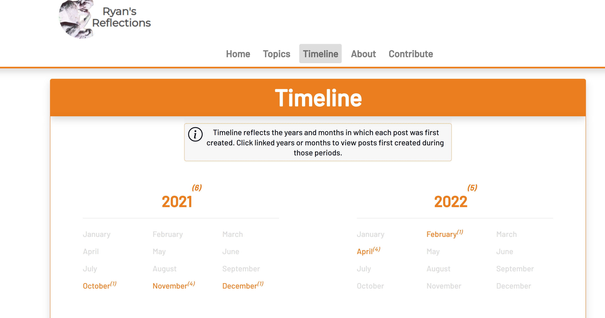

*******************
collaborative-blog
*******************

Collaborative Django blog app with built-in CMS.




This app emerged from a rough version which hosted my original blog. It is now
much more fully featured, offering configurability of each of the public site
pages that can be made visible, including the ability to enable multiple forms
to collect contact or contributor information and to allow viewers to subscribe
to automated newsletters.

It features a rich backend site where staff can author, collaborate on, and
manage posts, while admins can do all the good admin stuff to keep the site's
media fresh and current, manage newsletter and form features, and manage user
accounts and permissions.

All this verbosity below before the setup instructions is to provide detail on
the thinking behind different features, and how components of the blog application
work and can be used.

.. contents:: Contents

The Source Code
##################

The source code is in need of some refactoring, particularly, I think that all
the classes and modules related to sending emails should be focused into one
app within the project, rather than split between some modules in ``site_pages_forms``
and ``mail_subscription``. I have also noticed that the models and forms modules in
``admin_pages`` have gotten very long since the inception of my code base, and while
Models like ``Comment`` and ``Thread`` are only presented in their respective
ModelForms in the site_pages, they are still related directly to the ``Post`` object,
which is why the models and forms for them were placed in the ``admin_pages`` model.

Looking back, I probably would have split up the apps differently to avoid
areas of overlap between the apps (where ``site_pages.views`` has to import models
and forms from ``admin_pages``, for example), but I developed the basis of this blog
very quickly in about 2 weeks and have been building off of it ever since so...
sunk cost and all that. I still think the overall project is clean enough to
continue developing on.

Static Files and Database
############################

Static files are stored in an AWS S3 bucket where a specific hierarchy of
folders exists to serve the CSS, JavaScripts, and the many images related
to the public pages, to posts, and to profile images. The database is configured
to maintain a remote Postgres connection. The separation of static files and the
database from the application code was inspired by my experience with developing
microservices architectures. Using these external services not only allows for
very cheap static files storage but it increases the modularity of the blog,
making it easier to re-deploy elsewhere (without the need to roll a new database
and perform ETL, for example). The database could easily be swapped out with
something other than Heroku by changing the default database configuration
in ``blog/settings.py`` although changing from AWS S3 to another form of static
files storage would require a careful rewrite of many functions in ``admin_pages/views.py``,
(to use FileSystemStorage instead of my S3Upload models, for example) and perhaps
some lines in other modules.

Email
########

This app was configured to use the transactional email service, Sendinblue. I
use the free plan which allows sending up to 300 emails per day and I find its
templates to be very natural to create (because they basically use a subset of
Django's template tag language). I will provide example email templates that
can be created to display emailed form data and newsletters.

How it Works
------------

After the app is set up, an ``EmailAccount`` object of ID 1 exists (from ``admin_pages/models.py``).
The email address provided to this model (which is set in the administrative menu,
in Accounts > Email, or ``<site_url>/admin_pages/manage_email_account/``) will be
used as the recipient of submitted form data. This address can be separate from
the one used by Sendinblue.

Sendinblue
**********

Developers can `get an API key <https://help.sendinblue.com/hc/en-us/articles/209467485-What-s-an-API-key-and-how-can-I-get-mine->`_
for their Sendinblue accounts. Note that the `django-anymail documentation <https://anymail.dev/en/stable/esps/sendinblue/>`_
says that that only v3 keys (and not v2 keys) will work with Sendinblue. This
API key gets set as the environment variable, "BLOG_SENDINBLUE_API_KEY", so
Django can use the associated account with the SMTP backend to send the emails.

The next step would be to configure email templates that can parse the data
emailed (i.e., templates for the following: Subscribed Confirmation, Newsletter
(Featured only),  Newsletter (Recent only), Newsletter (Featured & Recent),
New Contributor Request, Email Contact Request, and Contact Request). Of course,
you only need templates for the forms you plan to use (if you toggle off the
Subscribe form and the Email Contact form, you would not need those templates).
The templates are given unique integer IDs which appear to the left of their
names in the table on Sendinblue's ``Templates`` tab (they should be marked active
too).

Robustness to identify and react to failures
********************************************

When the app fails to send an email, it saves the name of the form, the to address,
the time of the failure, and the form data which can be viewed through the
administrative menu > Failures > Mail Send Failures (``<site_url>/admin_pages/failures/mail_send_failures/30/``).
This page offers visualizations of instances where form data and newsletters did not
send, separately for the given number of days (default = 30: The current day and the
previous n-1 days).

The view allows attempting to resend the form data for each
form (but not for newsletters, at the moment). For example, if a template ID was not
configured for the Contact form, an Exception will be shown saying "Invalid template id"
for the unsent form data. This informs the admin to enter a valid template ID
in the Contact form settings. Then when they click "Resend", the form data may
be sent successfully.

The mail send failures view is ideal for identifying common (or rare) exceptions and
it ensures that admins can have have a backup record of the forms submitted to them
so the submitted form data is not just lost.

Using another transactional email service
-----------------------------------------

I suppose the email config could be changed in ``blog.settings`` to use another
transactional email service that ``django-anymail`` supports, assuming it uses
integer IDs for its email templates (which is an integral factor in how my
app sends form data). I do not know how rich the template languages are with other
providers or if the parameters sent from this app can be parsed by other providers
(I venture to guess that they can, but do your research).

All of that is to say, if you plan to use a service other than Sendinblue, be
prepared to tweak the code until you are able to get it sending data that can
be correctly parsed in your email templates, and be prepared for new exceptions,
although many exceptions...but not all
( see https://github.com/pinax/django-mailer/issues/73 )...can be captured by setting
``fail_silently`` to ``False`` when calling the ``send`` function of a ``django.core.mail.EmailMessage``
instance.

The Newsletter Feature
#########################

The newsletter feature of this site is in an experimental state, due to my
limitations in being able to test it. I host my blog using a version of this
code on a free Heroku Dyno. It is worth noting that the newsletter feature will
NOT work as-is on a free Heroku implementation because the Dyno's resources are
put to sleep after ~30 minutes of inactivity. That means that my scheduler
(in ``mail_subscription/newsletters.py``) is liable to be interrupted and would not
send newsletter emails at the appropriate time. A possible work-around would be
to write a loop in the scheduler to make an HTTP request to an endpoint of the
web app every 25 minutes to keep it alive. I chose not to do that for now.

A developer with some Django experience could also rewrite the scheduling to
use Django base commands along with a scheduler such as Heroku Scheduler which
can run cron-like jobs by spinning up one-off Dynos. If you are a developer
interested in doing that, feel free to reach out to me and I'll at least look
into helping develop some mechanisms for scheduling that can play well with
Heroku without breaking the ability to schedule newsletter options through the
administrative GUI.

While I expect the newsletter feature to work consistently on ordinary web servers,
I have yet to test it outside of my local environment. I plan to deploy an
implementation of this web app on an Ubuntu web server where I will employ the
newsletter feature which should allow me to assess the scheduler's viability and
make changes, if needed.

Users, Authors, Posts, and Collaborators
###########################################

Users, Authors
--------------

A User account (for login) is inextricably linked to an AuthorProfile account in
a 1:1 relationship. This design was to separate concerns between the user
information needed for authentication and administration (username, real name,
and email address) and the public-facing profile information that an author may
wish to display (preferred name, profile icon, and a bio). When a user is signed
in, they can find their 'Account Settings' dropdown menu in the top right
identified by their profile icon. In those settings "Author Profile" allows the
user to configure what public readers will see when they read one of their public
posts while "User Account" refers to the settings for the information used to
authenticate (including two-factor authentication) and the information that admins
can see (First & Last name and email address). It is **important** that each user
**specifies an email address they have access to** because their listed address is
used to facilitate password reset.


When is a user account created?
*******************************

In my configuration, user accounts are only ever manually created by an admin: me.
The purpose of the Contribute form on my site (currently https://ryansreflections.herokuapp.com/contrib/)
is to identify prospective contributors. If a contact seems like someone worth
giving access to post on my blog (currently no one, because I'm pretty sure no one
reads my blog), I will take their desired username, first name, last name, and
email address, and use that information to create an account for them.

My process after receiving an email with an instance of 'Contribute' form data is as
follows:

1) Create a user account from the admin side using the info provided in the form.
Set some bogus password (I should write a password generator on the account
creation view).

2) Send the user a personal email detailing their username and email, where to login,
etc., and a link to the password reset page (https://ryansreflections.herokuapp.com/users/reset_password/).
(I may eventually automate the sending, if not the composing, of such an email too).

Then the user's process upon receiving my email is:

1) Visit the password reset link, enter the email address associated with the
account, follow the reset link emailed, and follow the reset steps on the site.

2) At the end of password reset, the user is prompted to log in. After logging
in, they will be asked to configure a two-factor authentication (2FA) option. The
user will need a smart mobile device to install an authentication app such as
Google Authenticator. Once installed, they need to scan the provided QR code to
set up the 2FA. Then they will have to enter the 2FA token in order to complete
sign-in.

Why can't viewers register accounts?
------------------------------------

My answer to this question is multifaceted:

1) I didn't feel like it. This is the main reason. A viewer can already subscribe to
receive email newsletters and commenting is open to everyone. Giving a viewer an account
would mean that the account *does* something extra for them -- maybe they could have a
profile and their screen name and profile image could show up on their comments (right now,
if an author comments, their preferred name is used). Or maybe they could have a little
view where they can access their favorited posts. But making entirely new functionality
so someone can have a profile pic in the comments or so that someone can effectively do
what their browser's bookmark tool can do is not worth my time.

2) It presents an extra governance problem. There are more accounts of people
that you, as an admin, don't know. Some could have bad intentions. Many more
could just be forgetful or stupid, lock themselves out, and fill admins' inboxes
with messages for assistance. The governance problem is also characterized by
having more people's data. If I extened the app so that anyone could register an
account, I would plan for the future and expect a large quantity of users demanding
more account information be stored, primarily to make a feasible account recovery
process. I am very much a minimalist when it comes to storing personal information; my goal
is to do as much as possible for the user experience with as little information as
possible. At this time, I am not interested in collecting or storing a considerably
greater, and probably more detailed, volume of personal information that could come
with free account registration.

3) I've touched on this, but letting viewers register accounts does not accomplish much.
My suspicion is that most viewers will be casual. Frequent viewers who really want to
get involved in the community can simply contact the admin through the Contribute page
to get an account and contribute as an author. As the blog expands, trusted members who
the admin is acquainted with (hopefully well acquainted with) may be promoted to admin
to help manage the website. The candidate contributors do need to be vetted, at least
losely, to ensure their intentions and their writing skills. If there is a bottleneck
in people getting accounts, that is also a soft check against those who requested to
be a contributor who are not particularly dedicated to the blog's community.


OK, but I, as a developer, want to let viewers register accounts...What is the easiest way to go about it?
----------------------------------------------------------------------------------------------------------

I have left the blog open to be easy to allow for viewers to register user accounts
for possible future growth although, as you can read above, I am not compelled to
do that myself right now. If you wanted to transform this blog, to say, have a very
engaging social media-type community, you may want to let users register their own
accounts. Currently, standard accounts are really staff accounts (meaning ``user.is_staff == True``).
All users with staff (and not superuser) permissions have access to their user profile,
their author profile, and the ability to manage the posts they author (Create, Read,
Update, & Delete posts they author). They can also manage posts that they collaborate
on.

Admins are accounts that not only have the ``staff`` permission but the ``superuser``
one as well. With that, they can manage...everything. The site look, the content
of pages, which pages are accessible and visible to the public, the newsletter,
all other user accounts, an email denylist for spammers, and configure SEO.

That means a user without superuser or staff permission could be designated as
a "regular" user who has some type of profile access that does not allow them
to manage posts or other more elevated privelege. You could use a similar method
to my register method found in the ``users.views`` module, omitting, the ``is_staff``
assignment. At this point, I would consider using groups to designate types of
users to make permissions easier to assign and revoke (you might have 3 types
of users but one day you might have 4, then 5, so future-proofing is never bad).

If you want just any rando to be able to become an author on the blog (some kinda
anarchist blog), you could simply put up a registration page and link it in the
main navigation. The registration page would be just like the one I have used for
creating new users on the admin side, sans the "Is admin" checkbox. Then they
would get to create their own accounts. If you are an anarchist or a die-hard
libertarian interested in this ability to offer an underregulated free-speech blog
platform, I'd be happy to spend a few hours developing/designing it for you (in
other words, spend 10 minutes developing and like 200 minutes making the HTML look
right!).


Two-Factor Authentication
#########################

What? Why?
----------

My app has recently been configured to use 2FA tokens as a mandatory method for
users to have access to their accounts and the staff side of the site. From a
security perspective, 2FA should be mandatory in 2022, even at the expense of
convenience. So a developer could technically gut all the two-factor stuff from
the app, point the login URL back to my original login view in the users app,
tweak a few of my ``admin_pages`` templates and successfully use the site without
2FA, but nobody would be winning in that scenario: accounts would all be vulnerable
because of phishing attempts (do not underestimate the stupidity of any of your
users).

While there are certainly more convenient means than token generation, it is the
most reliable, not depending on the smart device to have any Internet connection.
It might be nice to have push notifications provided by the authenticator app and
use the OTP tokens as a backup option, but I'm too lazy to do that. Nobody pays me :)

Resetting 2FA
-------------

Users can always reset their own 2FA from their own account settings through
``Account Settings`` > ``User Account`` > ``2FA Settings`` > ``Reset Two-Factor Authentication``.
After that is done, they are immediately asked to configure a new 2FA method before they
can get back into the staff side of the site. Of course there is an obvious problem here.
If a user cannot *use* their 2FA method anymore, they cannot finish logging in to reset it
(a common example in my institution is when a user gets a new phone, haphazardly thinking
that their OTP codes will magically transfer to their new phone, which is an understandable
expectation given the way most app data transfers seemlessly). This is **why it is essential
for users to store their backup tokens**.

Backup tokens are also found on the 2FA Settings page
(``Account Settings`` > ``User Account`` > ``2FA Settings`` > ``Show Tokens``). They should store
these somewhere where they are (1) secure and (2) easy to locate. **It is strongly recommended**
to **instruct users to save these tokens** after setting up their accounts.

Desired Improvement
*******************

TL;DR: I will probably improve the capability of resetting 2FA by giving admins the ability
to reset 2FA on behalf of users **verbally** requesting it. In order to avoid undermining
security, admins will need to verify two pieces of personal information, again, **verbally**,
before fulfilling the request for 2FA reset (to securely confirm identity). The personal
information will not be mandatory to store on the site with the condition that admins will
only be able to do a reset contingent on there being personal information for a user that
can be verified.

The current 2FA setup is workable, but it still is not quite ready for institutional use,
to me, because the user can still be locked out of their account (if they don't have access
to their tokens). I will likely be prioritizing an administrative capability to reset 2FA
for the user so that they will be able to get to the 2FA configuration prompt. This will
necessitate more user account information, however, to avoid undermining the security (e.g.,
any user could claim they are the account owner and request 2FA reset; that threat is 
absolutely critical because if a user's email account was compromised, the hacker could
impersonate them by sending from the account and once 2FA is reset, all the hacker would
need to do is set up their own 2FA method using the account, because if the hacker is in
control of the email account, they are able to reset the user's password on the blog).

In the U.S., the last four digits of someone's Social Security Number (SSN) is one personally
identifiable (and still ubiquitously actually known) bit of information. More universally,
everyone knows their date of birth. My plan, at least in abstract, is to put form fields
in the User account settings form to enter last 4 digits of SSN (if applicable), date of
birth, and a challenge question from a fixed set of possible questions. It will be on the user
to enter this information after they initially set up 2FA on their account.

If the user contacts me or another admin, asking us to reset 2FA, our first recommendation
will be for the user to use a backup token and reset on their end. If that is not possible,
the admin will be required to verify either date of birth AND either SSN or the challenge
question (date of birth alone is woefully inadequate). These should ONLY be verified over
the phone or secure teleconference (or in-person if they have the luxury). If the user
cannot provide the necessary personally identifiable information, they should not be granted
the reset since we cannot prove their identity.

Lastly, because of the context of this blog, many users may not feel comfortable storing such
personal information in the site. Understandably so. If a user happens accross my blog, likes
what they read, and thinks "I could contribute to this blog", they may fill out my contribute
form and get setup to write posts on my blog, but they will have never met me in person, nor
will they have had a previous history with me. If I make it mandatory for them to enter their
personal info., they may very well say "forget it" (rightfully so; I wouldn't provide such
information unless I had a personal relationship with the site admin). So the personally
identifiable information should be optional, but it should be clear to users that if they do
not provide the PII and they somehow lose their backup tokens and cannot use 2FA, we will NOT
be able to help them get into their account.

Posts, Collaborators, and Topics
###################################

All posts can have a splash image, 1:N topics, one and only one main author (associated by
AuthorProfile), and 0:N collaborating authors. Collaborators have the same permissions to
the post as the original author, sans the ability to delete the post or manage collaborators.
If an author who is also a site admin is added as a collaborator on a post, the admin will
have all the same permissions as the original author, including the ability to delete the post
and manage collaborators. All posts have an ``og_date`` field, referring to their original
creation DateTime timestamp, and a ``date`` field (which I should have named ``date_last_mod``)
indicating the the last modified date and time.

``Topic`` objects have a ``name`` (e.g., "Sportsball") and a ``splash_image``, and can be marked
as featured using the ``is_featured`` boolean. When a topic is marked as featured, it gets
listed in a large box with its splash image behind it on the topics page. All topics
that exist (featured or not) are listed as links which can be filtered by name on the
topics page. Clicking a topic link on the topics page loads a 'topic_posts' view where
posts that include that topic are shown from most recent to oldest, and are searchable.

Services Required
#################

I will use free tiers of all the services besides the standard AWS S3 bucket storage.
While it is technically not free ($0.023/GB/month for my project; see https://aws.amazon.com/s3/pricing/),
my monthly costs are so low (fractions of a cent to a cent) that my invoices are waived.

- AWS S3 standard bucket
- Remote database (I will walk through setting up Postgres on Heroku)
- Sendinblue account
- TinyMCE account

Setup
######

Setup will be easiest to follow in the sequence I have written these sections in. For setup,
I recommend using a staging environment and then once everything seems to be working, to
move the configuration to a production server.

I will assume that Python is installed and that you can access it from a shell. If not,
there's this wonderful resource called the World Wide Web that can help. I will be using
Powershell and will leave some examples for Debian-based Linux as well.

Setup virtualenv
----------------

For this project, we want to first set up a virtual environment. This way, we can install
dependencies to this virtual environment rather than our global Python environment. This
will make it easier to track the dependencies our application uses, and easier to deploy
our project.

1. First, open your terminal to the main folder of this cloned repository and make sure you
have the virtualenv package installed:

``pip install --user virtualenv```

In Ubuntu-based distributions, you can install it using:

``sudo apt install python3-venv``

2. Create the virtualenv (still in the main repo folder):

``python -m venv venv``

3. Activate it.

3a. In PowerShell:

``.\venv\Scripts\activate``

3b. In Linux:

``source .venv/bin/activate```

To deactivate it (when you want to use your user Python environment), simply type
``deactivate``.

4. Install the requirements.

``pip install -r requirements.txt``

(You will have to use ``pip3`` in Linux)


Heroku Postgres Database Setup
------------------------------

Create the database
*******************

First, we will set up a remote database. Of course, you do not have to use Heroku or even Postgres
to host the database, but it is what I will use in this example.

1. If you don't have an account, make a free one and sign in.

2. After you are signed in, create a new app. Name it whatever you'd like.


3. Click the **Resources** tab and search "postgres" in the Add-ons search bar.


4. Select **Heroku Postgres** and choose your tier. I'm using the Hobby-Dev one.

5. Now click on the link to your database where it appears under Add-ons.

6. In the new tab, click **Settings**. And then click **View Credentials...**


Configure the project to use the Postgres database
**************************************************

1. Export the database variables listed on the credentials screen as the following
environment variables:

.. code-block::

    BLOG_DB_HOST: The Host string
    BLOG_DB_NAME: The Database string
    BLOG_DB_USER: The User string
    BLOG_DB_PORT: The Port string
    BLOG_DB_PASS: The Password string


Sendinblue Setup
----------------

Register a Sendinblue account at ( https://help.sendinblue.com/ ). Then refer to
`their instructions <https://help.sendinblue.com/hc/en-us/articles/209467485-What-s-an-API-key-and-how-can-I-get-mine->`_
to obtain an APIv3 key Once you have the key, export it to the variable:

``BLOG_SENDINBLUE_API_KEY``


TinyMCE Setup
-------------

Register a TinyMCE account at ( https://www.tiny.cloud/ ). Once you have finished
registering, click **Dashboard**.


1. On the dashboard, scroll down and copy the script. It will look like this:

``<script src="https://cdn.tiny.cloud/1/<X...>/tinymce/6/tinymce.min.js" referrerpolicy="origin"></script>``

2. Export this script to the following environment variable:

``BLOG_TINYMCE_SCRIPT``

You will need to escape the script's characters where your export statement (probably
located in .bashrc with all your other exports, if on Linux) would look like this:

``export BLOG_TINYMCE_SCRIPT="<script src=\"https://cdn.tiny.cloud/1/<X...>/tinymce/6/tinymce.min.js\" referrerpolicy=\"origin\"></script>"``

Notice that the string has been wrapped in quotation marks where the double quotes inside
it are escaped with the backslash character.

3. Click on the **Approved Domains** tab. Verify a a confirmation email if necessary and then
add "127.0.0.1" and your planned site's domain so TinyMCE will correctly work in testing
and production.


AWS S3 Setup
------------

Take a break. Make a cup of coffee. The S3 portion has many steps.

Creation
********

1. Try going to this site ( https://aws.amazon.com/console/ ). Click **Create an AWS Account** if
you don't have an account (unless this has changed from the time of writing, in which case, Google it).


2. From the AWS Console screen ( https://aws.amazon.com/console/ ), drop down the **All Services**
menu and look for S3 under storage. Click it.

.. image:: ./readme_images/aws-2-click-s3.pricing

3. Select **Create Bucket**.


4. Name the bucket. I am leaving all the other settings as the default. If you know what you're
doing, change them accordingly. Then click **Create bucket**.

If you haven't added a payment option, Amazon might prompt you before you can create the bucket.

Permissions
***********

1. If you aren't looking at the **Buckets** screen, navigate to **Amazon S3 > Buckets**.


2. Click your bucket's name under Name and then click the Permissions tab. Scroll to the very
bottom until you see the Cross-origin resource Sharing (CORS) section.
Click Edit and enter the following JSON:

.. code-block:: json

   [
        {
            "AllowedHeaders": [
                "Authorization"
            ],
            "AllowedMethods": [
                "GET",
                "POST"
            ],
            "AllowedOrigins": [
                "*"
            ],
            "ExposeHeaders": [],
            "MaxAgeSeconds": 3000
        }
    ]

So we are allowing any domain right now by using the star character. Eventually, we will
want to change this to our website's domain once we are in production, but this will do
for now.

2. Navigate to the main AWS Console screen. You can click the AWS icon in the navigation or
re-enter the URL: https://aws.amazon.com/console/

3. Type "iam" in the navigation search bar and click on the IAM option that shows up. In
the IAM dashboard, click Users in the Access Management menu on the left:


4. Click **Add Users** and we are going to create a new user, giving them a key for
programmatic access:


5. Next, under **Set Permissions**, choose **Attach existing policies directly**. Then type
"amazons3" in the search bar to filter the options and tick **AmazonS3FullAccess**.


6.  Click **Next**. Skip the tags screen and then click **Create user**.


7. Download the CSV file containing your credentials.


Configure the project to use your S3 bucket
*******************************************

1. Export the variables listed in your credentials file to the following
environment variables:

.. code-block::

    AWS_ACCESS_KEY_ID
    AWS_SECRET_ACCESS_KEY
    AWS_STORAGE_BUCKET_NAME


The first two variables are listed in the file and the bucket name can
be found on the AWS webpage.

2. Now it is time to upload all the necessary static files in their hierarchy to your
S3 bucket. To do that we will need to install the Python package, ``awscli``:

``pip install awscli``

3. Now from the top level of the project repo, we will change directory into the
"S3" folder and run our upload command:

.. code-block:: bash

    cd S3
    aws s3 cp . s3://example-bucket/ --recursive


Just be sure to replace `example-bucket` with the name of your S3 bucket.

Note: Since your AWS environment variables are exported, you should be able to
establish a connection to your S3 bucket through the AWS CLI. It should be noted,
however, that if you find yourself encountering an error, you may need to sync your
system's clock to match the current time. If you still experience difficulty, you
may need to export another environment variable, ``AWS_DEFAULT_REGION``, which should
store the same region as your S3 bucket (for me, that is "us-east-1").

After all this work, you are *almost* ready to launch the blog (I promise the next parts
are easy ;D).


Setting the Timezone
--------------------

When DateTimes are created for objects, they will be created relative to your timezone.
Export your timezone to the following environment variable:

``BLOG_TIME_ZONE``

Timezone value examples are CET, EST, and GMT, or 'Europe/Berlin', or even 'Etc/GMT+1'.
Timezone values can be found in `this list <https://en.wikipedia.org/wiki/List_of_tz_database_time_zones>`_.


Setting Debug
-------------

Debugging is nifty, but must be turned off in production. The debug settings are set
through the following environment variables:

``BLOG_DEBUG`` and ``BLOG_DEBUG_PROPAGATE_EXCEPTIONS``

Both of these variables must be exported with a value of either 0 (for false) or 1
(for true). I use numbers instead of False and True to be consistent with the way
Heroku lists other boolean environment variables. As the name suggests, the
DEBUG_PROPAGATE_EXCEPTIONS variable will show the debug exceptions even when debug
mode is not enabled. This can be useful when your server is in production and you
encounter HTTP 500s, where the log of stdout from the application should show the
detailed exceptions.

Exporting your Django Secret Key
---------------------------------

Generate a Django secret key for yourself. I like to use ( https://djecrety.ir/ ).
Export it to the following environment variable:

``BLOG_SECRET_KEY``

I recommend wrapping the key in double quotes on Linux.


Populating the Database and Creating your Initial Admin Account
---------------------------------------------------------------

Migrate the Database
********************

To migrate the database, open a terminal to the main project folder of this repo where
it is cloned and run the following commands:

.. code:: bash

    python manage.py makemigrations admin_pages --skip-checks
    python manage.py makemigrations mail_subscription --skip-checks
    python manage.py migrate --skip-checks


Run the Initial Setup Script
****************************

Now open your interactivate project shell. If you are not already using
your virtualenv, activate it now: ``.\venv\Scripts\activate`` (or ``source venv/bin/activate``).
Then enter:

``python manage.py shell``

Once in your shell enter the following line:

.. code:: python

    exec(open('initial_setup.py').read())


Follow the prompts to complete initial setup. The username and password you
generate will be what you use to log into the blog app from the login page.

After the setup script has been run, you will have to exit the shell using `exit()`.


Running the server, Logging in
------------------------------

1. The server can be started by entering `python manage.py runserver` from the root project
folder.

2. Visit the URL (http://127.0.0.1:8000). To login, scroll down to the footer and click the
copyright symbol which links to your staff login page (<site_url>/account/login). Enter your
admin username and password.

.. image:: ./readme_images/localserver-1-footer-login-link.png

3. After you have entered your username and password (correctly), you will be asked to configure
two-factor authentication. I recommend using the Google Authenticator app. Follow the prompts; the
process is straightforward. Pause on the page with the header **2FA Setup Complete**.


4. On the **2FA Setup Complete** screen, click **Account Security Options** > **Show Tokens** > **Generate Tokens**.
Select over all of the tokens with your cursor and copy them. Then paste them into a text file and store them
somewhere safe. That way, if you ever are not able to use your authenticator app, you can log in with one of the
backup tokens and then reset your 2FA after you are logged in (so you can reconfigure your 2FA). This is preferable
over getting locked out and having to go in through the command line to either remove your default 2FA method or to
create a new admin account.


Configure Your Email Recipient and Email Templates
--------------------------------------------------

Email Recipient
***************

1. From the administrative menu, click on **Email** under **Accounts**.


2. Enter the email address to which form data will be sent.


Email Templates
***************

For each form that you plan to use, you need to designate an email template for the form's data. Email templates
are created in Sendinblue where each template is given an integer ID.

As an example, let's say you have the contribute page set as visible (page visibility is set in the administrative
menu by going to **Pages** > **Site Look** and checking **Show Contribute page**). As such, the contribute form
is active on your site. If a user submits their form data, there is currently no valid template ID that my
``form_sender`` module can use to send the form data to your recipient email account. Rather, on their submission,
a form failure will be stored in the administrative page **Failures > Mail Send Failures** and the exception listed
will say "Invalid template id":


If I look in my Sendinblue Templates, I can see that there is no form with an ID of 0 (the default my app set) and
that the correct ID, in my case, would be the template with an ID of 1 as you can see below (that is the template
I have created to send the Contrib form data):


That template ID can be set from the admin menu from **Forms** > **Contrib Form**. But that requires you to have
email templates set up! Let's get started on setting those up.


Create your first template and tell the site to use it
======================================================

I have created shareable links to my templates which will correctly serve the form data. Make sure you are logged
into your Sendinblue account in your web browser and follow this link, which is the template for Contrib data:

https://my.sendinblue.com/template/kT_c4V82kD8zfJ2N6KR6jrew_aaWbgcpM.6w1HOLuABt5YY6Mwiwcjwt


1. You will probably be brought to an editor screen. and this is where you would want to change out my header
image with a header image of your own (or just delete the image for now). Notice that some of the text is highlighted.
That is where I have typed the parameters. For example, the actual text I typed for the title is `{{ params.title }}`,
"name" actually has the text, `{{ params.name }}`. The "params" are actually received by Sendinblue from my `form_sender`
module and it populates the template with the parameters sent to it so the recipient gets all the form data. The template
format does not matter, but if you delete a parameter, you will not receive that part of the form data which my application
sends.


When you have edited the template how you want, click **Continue** > **Save & Activate** > **Save & Quit**
(left of Save & Activate).

2. Now you will see that you have one template, its title indicates that it is for sending data from the Contrib form, and
its ID is 1:


3. Now to set the ID of 1 for our Contrib form, from the administrative menu of the locally hosted blog site, go to
**Forms** > **Contrib Form**. Change the ID from 0 to 1.


Testing the Contrib form
========================

1. Now on the public-facing Contribute page (<site_url>/contrib/), fill out and submit the form.


2. Check the inbox of the account that you set as your email recipient on the blog. Hopefully
you will receive an email that looks similar to this one shortly:


Note: If the sender is showing up as "Ryan's Reflections", you will want to edit your template. From the **Templates**
screen on Sendinblue, click **Edit** on your template, and then select **Setup** and change the setup information to
what you want:


Shared Form & Newsletter Email Templates
========================================

Linked below are standard templates I have created for each of the forms and for newsletters. You will notice
there are 3 different Newsletter templates: one if both Featured and Recent posts are shown and a template
each for exclusively for Featured or Recent posts. Those three template IDs can be set from the admin menu
in **Forms** > **Subscribe Form**. The subscribe form settings also ask for a "Subscribed" template ID. That
is the template I used to send an email to a user to confirm that they have subscribed.

I recommend importing each of these templates to your Sendinblue since they already include all the parameters
that my application uses. You can always re-style them to your preferences.

- **Contrib**: https://my.sendinblue.com/template/PAZS713LD72mv1dYrWwbqHfenkYN1reKaZXHIkwpuoBJCNIs2MLiou7\_
- **Contact**: https://my.sendinblue.com/template/mzdxFvS9RjEq9CjRTnnUg7oTFAWYIyNAmBaycpDJN5hSJJnzYQqd.VOd
- **Email Contact**: https://my.sendinblue.com/template/LrB2yp2rOgsukWL6gNBexT1WTDVOnt1uHstJzsW.2XPBATPL8fZGequ1

- **Subscribed**: https://my.sendinblue.com/template/QtIjQNca3qR.qxRCYYvTYQHR.M50VbjIj7MSMQMFtjJS.0wRE89ujK9P
- **Featured and Recent Newsletter**: https://my.sendinblue.com/template/aVouJ3Bqr9Jv0fJChWAUy1TBexSx7uk7S8nFJleCwFPYfMh1TnpVLohP
- **Featured Only Newsletter**: https://my.sendinblue.com/template/AibNTaHWXCwXhNrQqoDuq9N9vpNtEauMTgDzk33y.wu7OxqlRr7FcHWV
- **Recent Only Newsletter**: https://my.sendinblue.com/template/o6hO1AVEomgL6vnrRPrOB3NZeFKri4KLg72loFo7tHE6m28BMGd0.slY

After you have imported the templates, update the respective template IDs in the **Forms** settings in the admin
menu as I did in the example above with the Contrib form.

Customizations
--------------

The layout is already designed to be fully responsive to screen size and the layout also responds to the content
you enter. For example, on the about page, the layout will display either centered, if you have one main about section
or it will display two side-by-side text boxes if you have two sections of text. Similarly, the contact page and the footer
will format appropriately according to what information you enter. Each page has a variety of settings through the
administrative menu in the **Pages** section.

The Style
**********

All the style rules are in the `S3` folder (although they get uploaded to your S3 storage bucket). You can edit
files stored in your S3 bucket directly in Visual Studio Code using the AWS Toolkit extension. Assuming you have
set the AWS environment variables and your system clock matches the correct time for your timezone, AWS Toolkit should
automatically allow you to access your cloud services and your S3 bucket will be found under **S3** in the AWS Toolkit
Explorer pane.

One basic style modification that I recommend is changing the green accent color that is used throughout the blog. This
color is set in the root class as ``--clr-brand-green`` and a slightly darker green color used for when buttons are hovered
over is defined by ``--clr-brand-green-hover``. These properties are set in the main stylesheet (<S3bucket>/css/style.css).
Rather than refactor the names, which would not only require you to do so in the CSS file but in the many different HTML
templates as well, simply change the actual color values to whatever colors you prefer.



Above: What the timeline page looks like when ``--clr-brand-green`` is set to `28, 84%, 53%` in the main `style.css` file.


Deployment
----------

I don't really have any special notes for deployment at this time. To my knowledge, deploying this application should
not be particularly different than the deployment of any other Django project. Of course, remember to set your domain
(in place of 'yoursite.com') in ``ALLOWED_HOSTS`` in ``blog/settings.py`` and all the environment variables needed to
run the blog app in development are still needed in production so you should probably export all of your environment
variables needed for it prior to trying to deploy it.

Bugs
----

If you notice a bug, please report it to me on Github. Understand that this is one of several of my side projects
and I do not plan to devote an exhorbitant amount of time toward minor bugfixes. If you want to contribute to this code,
contact me (a clean refactor would be welcome :D).
